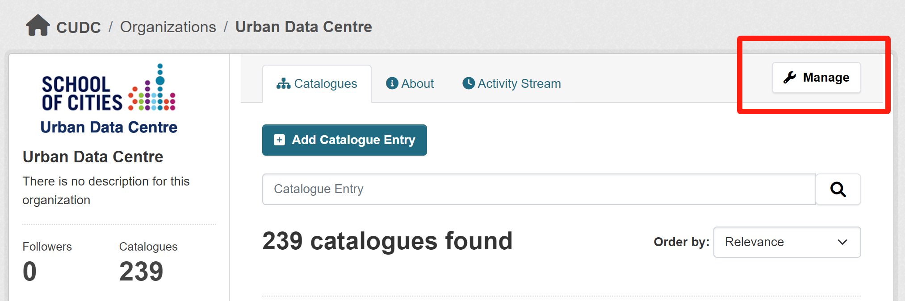
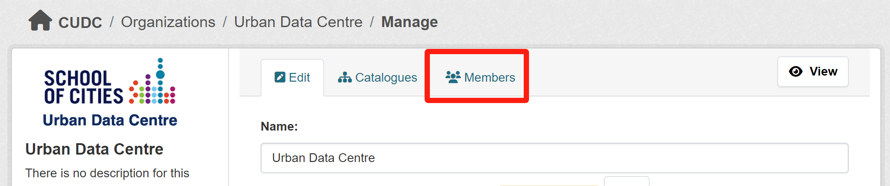
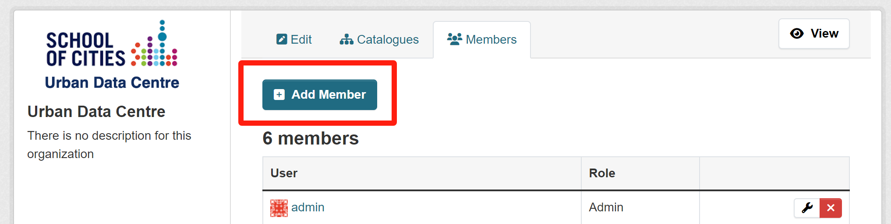
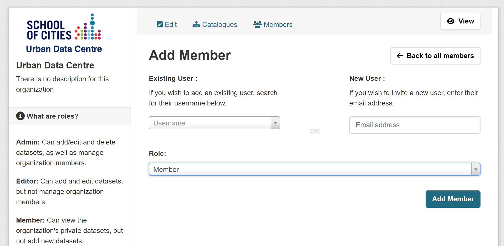

# How to Add a User to an Organization

**Only organization admins or system administrators can add members.**

### Steps to Add a Member:

1. **Go to the organization's page and click "Manage"**  
   

2. **Click "Members"**  
   

3. **Click "Add Member"**  
   

4. **Enter the username** of the person you want to add, then select their role:  
    - **Admin**: Can manage datasets and members.  
    - **Editor**: Can manage datasets but not members.  
    - **Member**: Can view private datasets but cannot manage or add datasets.

   
