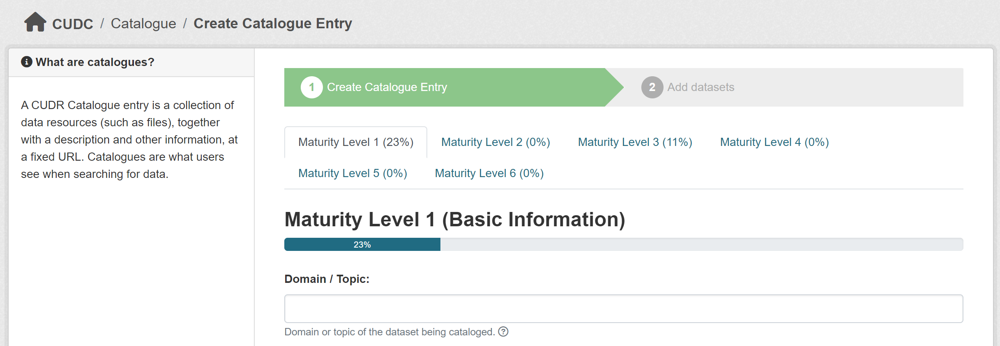

# How to Add a Catalogue Entry

To create or manage catalogue entries in CUDC, you must be **associated with an organization**.

You can either [create a new organization](/organization/new) or request to join an existing one. To request access, you can contact the system administrator [via email](mailto:support@mail.urbandatacentre.ca) or reach out directly to the organization admin.

When creating a catalogue entry, you will be asked to fill out information across a set of **maturity levels**. These levels help evaluate the completeness and reliability of the dataset.

You can see the full documentation of the maturity levels [here](/udc-react/faq/maturity-levels).

