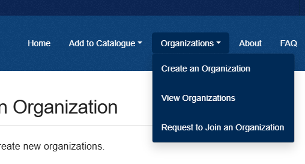
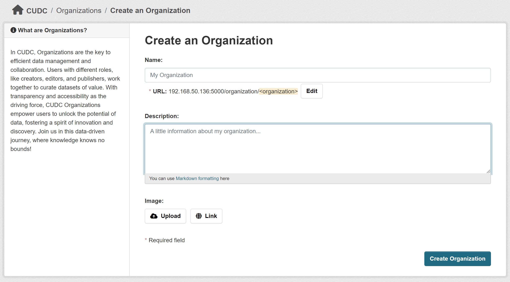

# How to Create an Organization

As a registered user, you can create new organizations.

**To join an existing organization, you can contact the system administrator [via email](mailto:support@mail.urbandatacentre.ca) or reach out directly to the organization admin.**

### Steps to Create an Organization:
1. **In the header menu, under `"Organizations"`, select `"Create an Organization"`**

2. **Complete the required fields in the form.**
